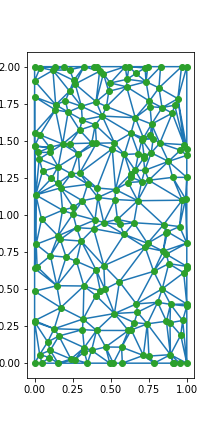
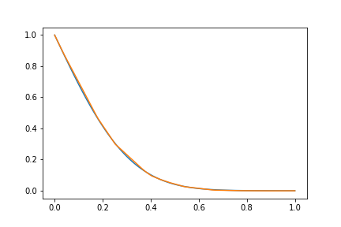

# FiniteElementADE

This project is a simple finite element derivation (available in the Python Jupyter notebook) to solve purely 1-D diffusion equation on two-dimensional grid.

The solution comparison in the middle of the domain is here:

